[Validators](#validators)
* [Lighthouse](#lighthouse)
* [HTML](#html)
* [CSS](#css)
* [JSHINT](#jshint)
* [PEP8](#pep8)

[User Stories Testing](#user-stories-testing)

[Responsiveness](#responsiveness)

[Bugs](#bugs)

# Lighthouse 

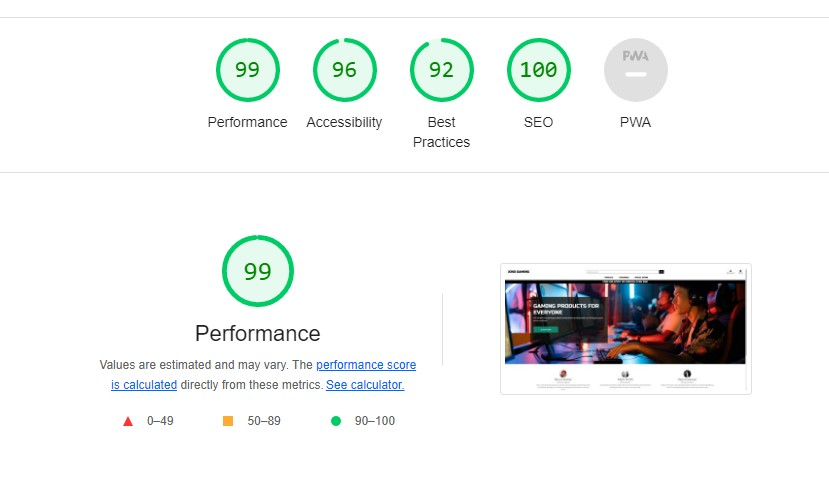

# HTML

- All Pages were checked with the official [W3C validator](https://validator.w3.org/). 

## Home Page

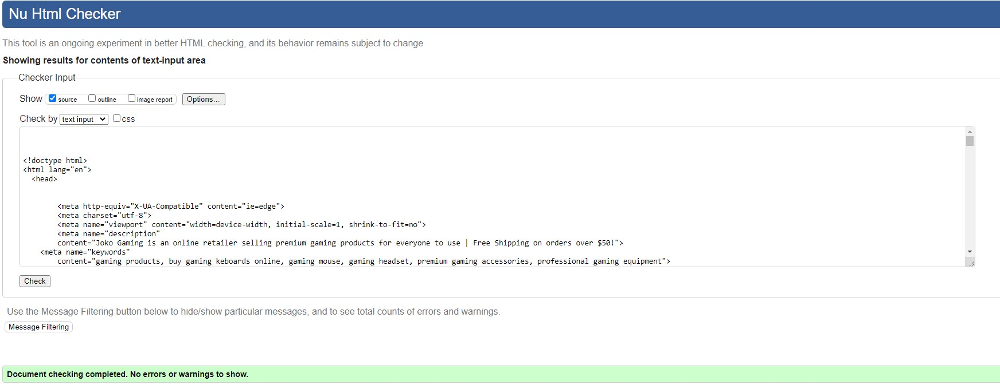

## Products Page

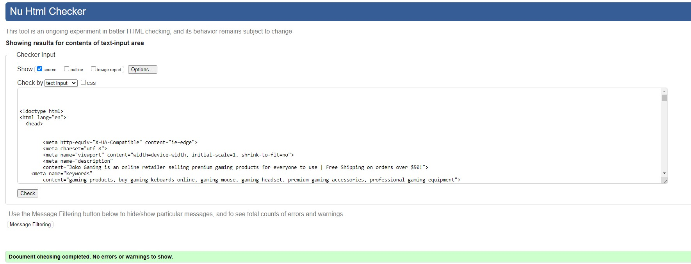

## Product Detail Page

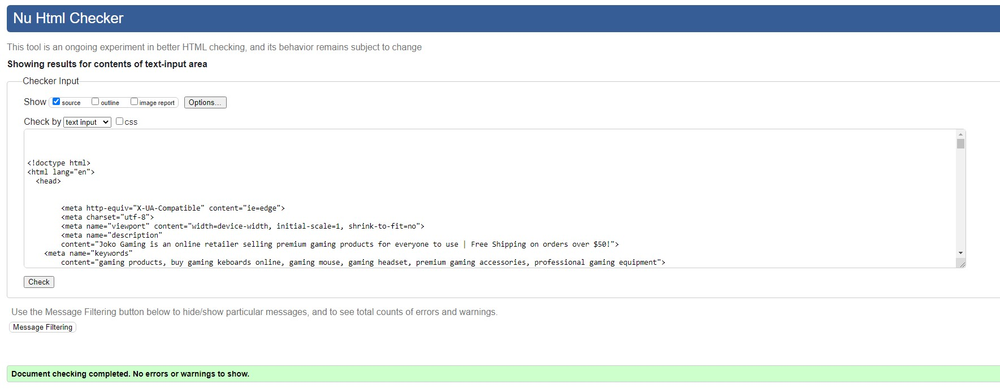

## Shopping Bag

Unsolved bug! "Error: Duplicate ID delete_3." error ocurrs due to two delete buttons with the same ID.
Due to lack of time, it remained unresolved.

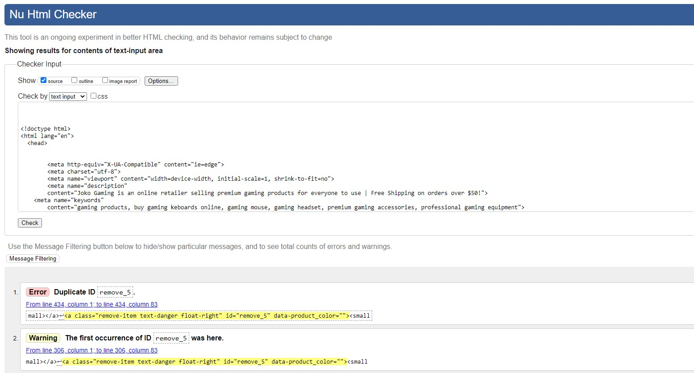

## Checkout Page

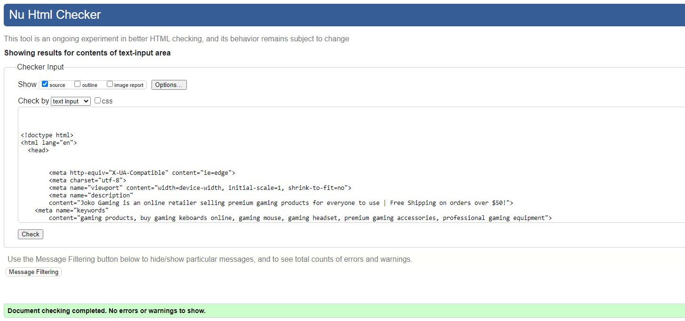

## My Profile Page

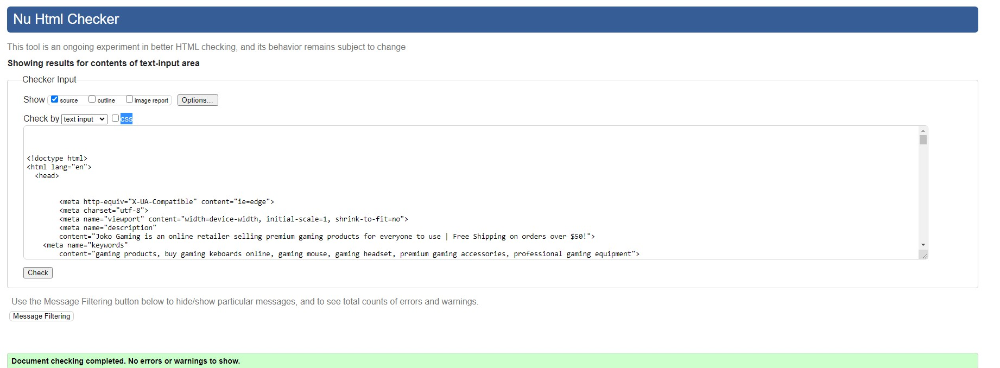

## Wishlist

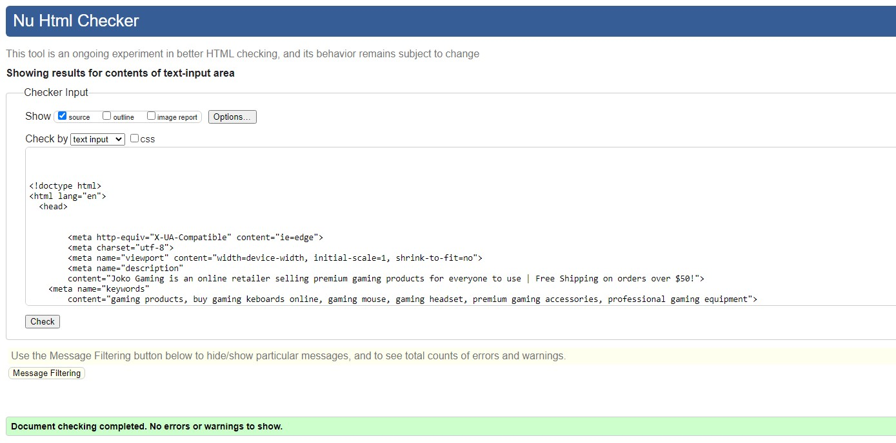

## Admin Profile

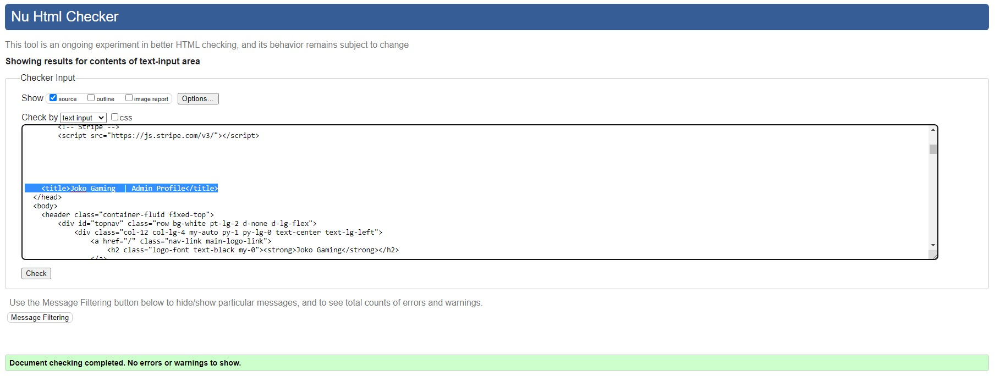

### Add Category 

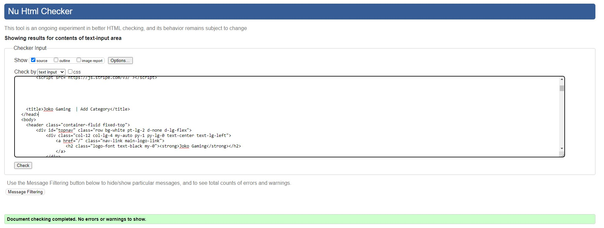

### Add Product

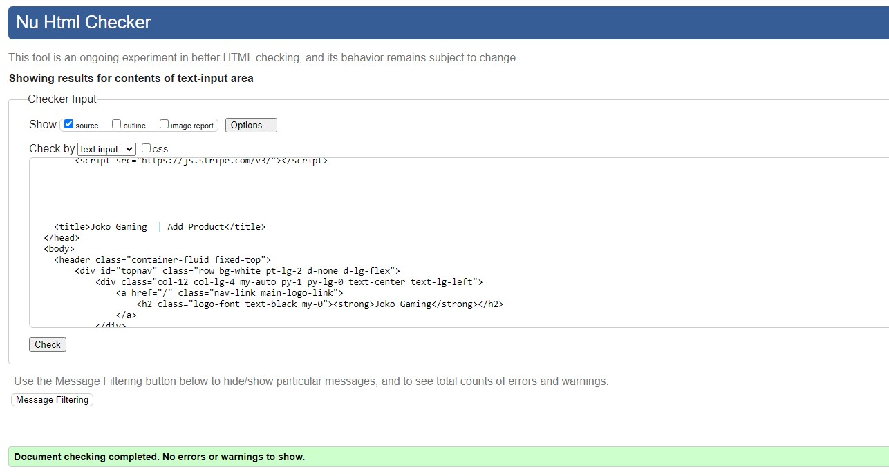

### Add FAQ's

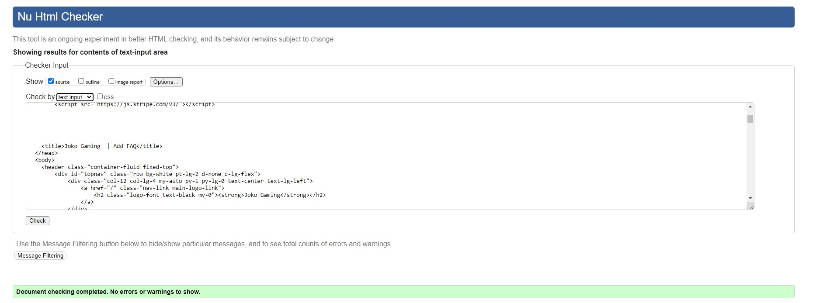

## FAQ's

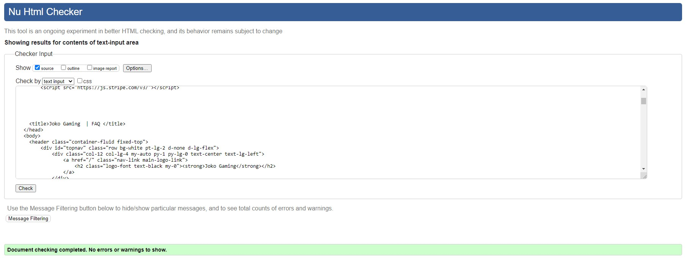

# CSS

## base.css

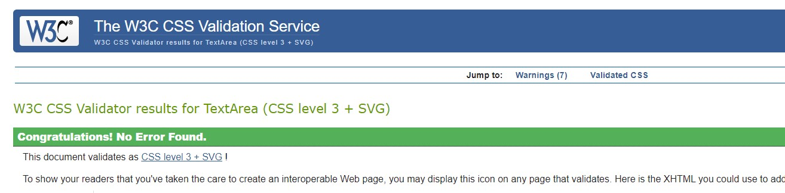

## products.css

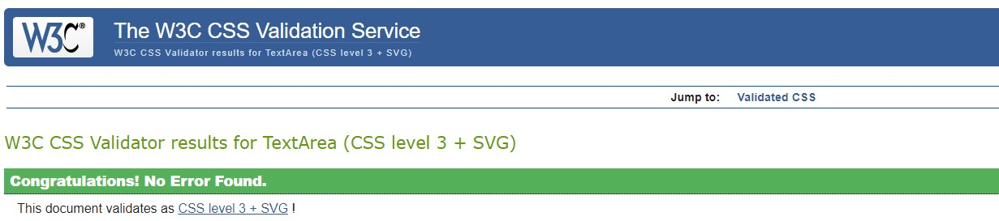

## checkout.css

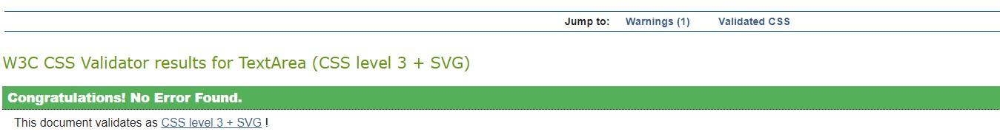

## profiles.css

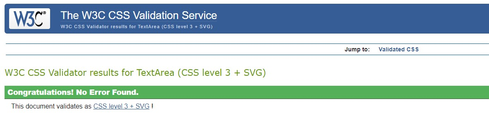

# JSHINT 
- All JS was passed through Jshint

## Checkout 

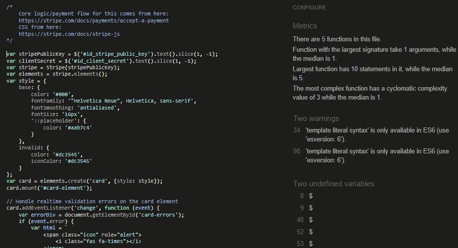

## Shopping Bag quantity buttons

Unsolved bug! "...used out of scope" and "...is already defined "error ocurrs.
Tried to fix a few times and could solve the JShint error but the function didn't work. 
Due to lack of time, it remained unresolved.

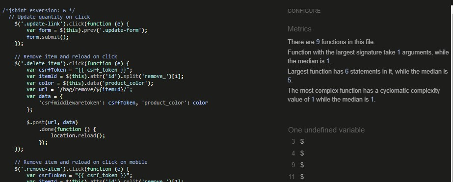

## Shopping Bag

# PEP8
 - PEP8 only shows the type of errors that can be ignored.

 

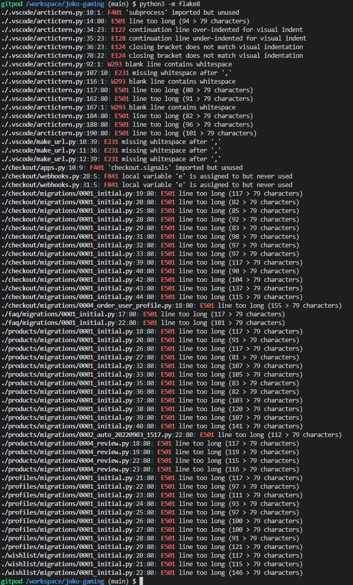

# User Stories Testing

## EPIC: Admin
1. As a store owner I want to be able to log in so that I can have full access to the store
    -  Admin can login/out from admin panel and have full access to store backend

2. As a store owner I want to be able to add new products so that I can add new items to my store
    - Store Owner can add products directly from Admin panel

3. As a store owner I want to be able to add new categories so that I can make items is easy to find
    - Store Owner can add categories directly from Admin panel

4. As a store owner I want to be able to add FAQ's to the site so that I can answer questions a user might have
    - Store Owner can add FAQ's directly from Admin panel

5. As a store owner I want to be able to edit/update a product so that I can change product prices, descriptions, images and other product criteria
    - Store Owner can edit/delete products from Product page and Product Detail page

6. As a store owner I want to be able to edit/delete categories so that I can change category names and keep the site up to date
    - Store Owner can edit/delete categories directly from admin panel

7. As a store owner I want to be able to edit/delete FAQ's so that I can change questions and answers
    - Store Owner can edit/delete questions directly from the FAQ's page or from admin panel

## EPIC: Navigation

8. As a shopper I want to be able to easily navigate through the site so that I can view desired content
    - Navigation is located on each page so that the user can easily and simply navigate through the page and find all the necessary information.

9. As a shopper I want to be able to quickly identify deals so that I can take advantage of special saving on products
    - The navigation bar has a dropdown to Special Offers with links to New Arrivals and Deals.
    
10. Aa a shopper I want to be able to view a list of products so that I can select some to purchase
    - On the Product page, the user can see a list of all products and can sort them by price, name, category and rating.

11. As a shopper I want to be able to view a specific category of products so that I can quickly find products without having to search through all products
    - The navigation has a dropdown with categories. Has new categories are added the dropdown will be updateded accordingly.

12. As a shopper I want to be able to sort products by rating, price and name so that I can easily find what I'm looking for
    - User can sort products by price, rating, name and category on the Product page.

13. As a shopper I want to be able to search for a product by name or description so that I can find a specific product i'd like to purchase
    - User can use search bar to search for specific product.

14. As a shopper I want to be able to easily see what i've searched for and the number of results so that I can see whether the product I want is available
    - The product page will only match products that matches the users search query with the number or results and the query visible.

15. As a shopper I want to be able to view individual product details so that I can see the price, description, product rating, product image and reviews
    - The user can click on the image on the product page to see the product details page with price, description, product rating, product image and reviews.

16. As a shopper I want to be able to read FAQ's so that I can find answers to common questions before or after purchase
    - The user can find the FAQ page with all the faq's from the footer that is located on each page.

## EPIC: Purchase

17. As a shopper I want to be able to easily select the quantity of a product when purchasing it so that I can ensure I don't accidentally select the wrong quantity
    - User can select quantity of the desired product on Product Detail page and on Bag page

18. As a shopper I want to be able to view items in my bag to be purchased so that I can identify the total cost of my purchase and all items I will recieve
    - User can reach the bag and total cost at anytime from the navigation. Inside the bag you can see all the products added and make changes.

19. As a shopper I want to be able to adjust the quantity of individual items in my bag so that I can easily make changes to my purchase before checkout
    - User can select quantity of the desired product on Product Detail page and on Bag page

20. As a shopper I want to be able to easily enter my payment information so that I can checkout quickly and with no hassles
    - User can reach the checkout page from the bag and enter payment information from a form. A logged in user can have the form prefilled before checkout.

21. As a shopper I want to be able to view an order confirmation after checkout so that I can verify that I haven't made any mistakes
     - User can see the order confirmation direcly after checkout. On the profile page a user can see an order history to always check historic purchases.

22. As a shopper I want to be able to recieve an email confirmation after checking so that I can keep the confirmation of what I've purchased for my records
    - User will get an email confirmation after checkout.

## EPIC: User Interaction

23. As a user I want to be able to see ratings and reviews of products so that I can read the opinions of other users
    - A user can see ratings on the product page and on product details page. Reviews can be read on the product details page.

24. As a user I want to be able to sign up for a newsletter so that I can keep track of newly added products and sales
    -  A newsletter sign up form is visible in the footer from the entire site.

25. As a user I want to be able to unsubscribe from the newsletter so that I can stop recieving emails it i've lost interest
    - In the newsletter an unsubcription link is visible within the mail.

26. As a logged-in User I want to be able to leave ratings and reviews so that I can share my experience with others
    - A user can leave ratings and reviews on the product details page. 

27. As a logged-in User I want to be able to save selected products to my whishlist so that I can remember what i've been interested in
    - A user can add products to a whislist from the product details page and is reachable from the navigation.

## EPIC: Accounts

28. As a user I want to be able to easily register for an account so that I can have a personal account and be able to view my profile
    - A user can navigate to an account registration form from the navigation and the review section on the product details page

29. As a user I want to be able to easily login or logout so that I can access my personal account information
    - A user can find links to login and logout from the navigation bar.

30. As a user I want to be able to easily recover my password in case i forgot it so that I can recover access to my account
    - A link to reset password is visible from the login page.

31. As a user I want to be able to receive an email confirmation after registering so that I can verify that my account registration was successful
    - After a user register for an account they will recieve an email confirmation to verify the email and will get redirectet to a success page.

32. As a user I want to be able to have a personalized user profile so that I can view my personal order history and order confirmations and save my payment information
    - A user can reach their personal profile from the navigation with order history and able to save payment information.

# Responsivness
The page is fully responsive and all user stories works in both mobile and desktop
